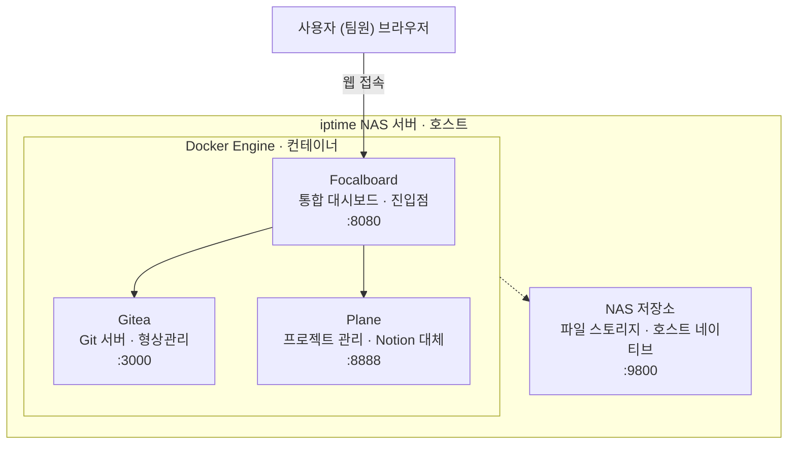

# 오픈소스 기반 팀 협업 인프라 구축·운영

**프로젝트**: 재조합 (블루이글루) 게임 개발 · 인디 게임 개발 · 2026.02 ~ 현재

## 개요

iptime NAS 서버 위에 Docker 컨테이너로 Gitea·Plane을 구동하고, Focalboard로 통합 대시보드를 구현해 팀원이 한 곳에서 효율적으로 접속·관리하도록 설계했습니다.

## 상세 설명

iptime NAS의 Docker 환경에 각 서비스를 독립 컨테이너로 배포했습니다.

- **Focalboard** (`:8080`) — 팀 진입점 대시보드
- **Gitea** (`:3000`) — 형상관리
- **Plane** (`:8888`) — 프로젝트·이슈 트래킹
- **NAS 자체 파일 스토리지** (`:9800`) — 리소스 백업 및 대용량 에셋 공유

각 서비스는 내부망에서 포트 포워딩으로 팀원 누구나 URL 접속만으로 이용할 수 있도록 구성했습니다.

## 아키텍처

## 스크린샷

---
[← 포트폴리오로 돌아가기](../index.html)
