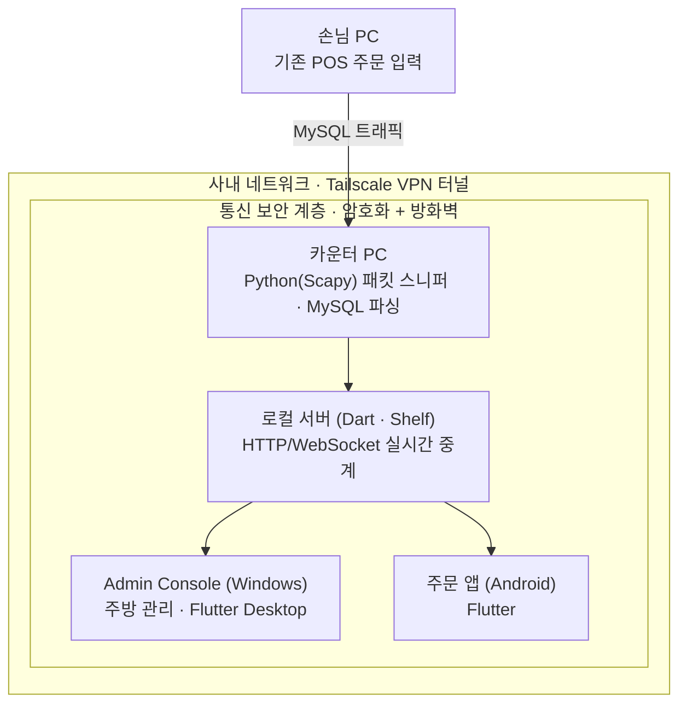

# 패킷 스니퍼·로컬 서버 구축

**프로젝트**: 매장 관리 통신 시스템 · 개인 프로젝트 · 2025.11 ~ 2026.02

## 개요

Python(Scapy) 패킷 스니퍼로 기존 POS의 주문 데이터를 추출하고, Dart(Shelf) 로컬 서버로 Flutter 기반 Windows/Android 클라이언트에 실시간 전달했습니다.

## 상세 설명

카운터 PC에서 Python(Scapy) 패킷 스니퍼가 기존 POS 시스템의 MySQL 트래픽을 실시간으로 파싱해 주문 데이터를 추출합니다. Dart(Shelf)로 구현한 로컬 HTTP/WebSocket 서버가 이 데이터를 Flutter로 만든 Windows Admin Console과 Android 주문 앱에 실시간 브로드캐스트합니다. 전 구간은 Tailscale VPN으로 구성된 사내망 안에서만 통신하도록 격리했습니다.

## 아키텍처

## 클라이언트 애플리케이션 (Flutter)

주문·주방 관리를 실제로 사용하는 클라이언트는 Flutter로 구현해, 하나의 코드베이스로 Windows(카운터·주방용 Admin Console)와 Android(주문 접수용 모바일 앱)를 동시에 대응했습니다.

- **android_app** — 주문 접수용 모바일 앱
- **admin_console** — 주방/카운터에서 사용하는 Windows 데스크톱 앱 (Flutter Desktop)
- **Inno Setup**으로 Windows 설치 프로그램을 패키징해 배포

레포지토리: [github.com/JJH0204/AllbenKitchenManager](https://github.com/JJH0204/AllbenKitchenManager)

## 작업 히스토리

실제 커밋 로그 기준 개발 흐름입니다.

| 시기 | 작업 내용 |
|---|---|
| 2026.01.28 | 프로젝트 초기 구조 설계 및 목업(Mockup) 빌드 |
| 2026.01.30 | Android 앱 · Admin Console · Python 패킷 스니퍼 3개 구성요소로 초기 프로젝트 구조 구현. API·WebSocket·정적 파일 서빙 + MySQL 패킷 스니퍼를 포함한 로컬 서버 구현 |
| 2026.01.31 | Python 런타임 환경 및 lxml·requests·urllib3·pyshark 등 의존성 정리 |
| 2026.02.01 | 배포용 설치 스크립트 작성, Dart(Shelf) 기반 로컬 HTTP/WebSocket 서버로 주방 데이터 관리 기능 구현 및 Python 패킷 스니퍼 연동 |
| 2026.02.02 | Scapy 라이브러리 도입, MySQL 패킷 스니핑·파싱·비동기 로깅 구현 (AllbenScapySniffer) |
| 2026.02.04 | 주방 관리 앱의 핵심 UI, 데이터 모델, 상태관리(Provider) 구현 |
| 2026.06.13 | 메뉴 조리시간(cookTime) 로직 및 관련 UI 업데이트 (운영 중 유지보수) |

## 스크린샷

_추가 예정_

---
[← 포트폴리오로 돌아가기](https://jjh0204.github.io/JJH0204/)
