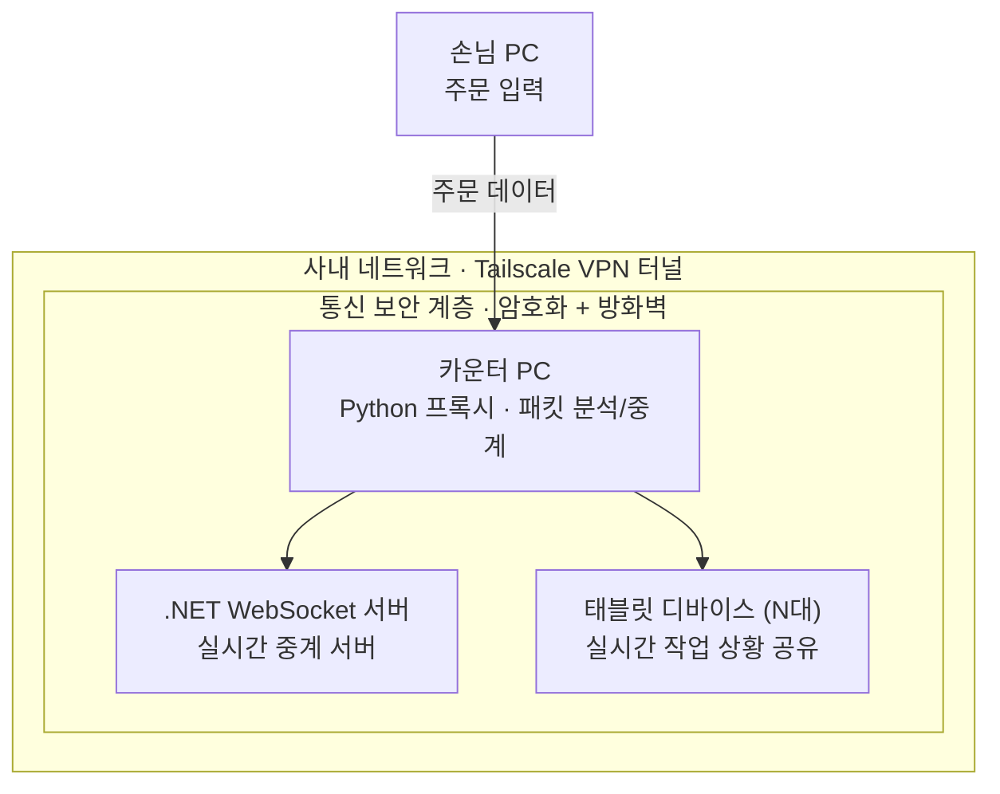

# 프록시·웹소켓 서버 구축

**프로젝트**: 매장 관리 통신 시스템 · 개인 프로젝트 · 2025.11 ~ 2026.02

## 개요

Python 프록시 + .NET 웹소켓 서버로 주문을 태블릿 등 연결 디바이스에 전달하고 작업 상황을 실시간 공유했습니다.

## 상세 설명

카운터 PC의 Python 프록시가 패킷을 분석해 주문 데이터를 추출하고, .NET WebSocket 서버가 이를 태블릿 등 연결된 디바이스로 실시간 브로드캐스트합니다. 전 구간은 Tailscale VPN으로 구성된 사내망 안에서만 통신하도록 격리했습니다.

## 아키텍처

## 스크린샷

_추가 예정_

---
[← 포트폴리오로 돌아가기](../index.html)
