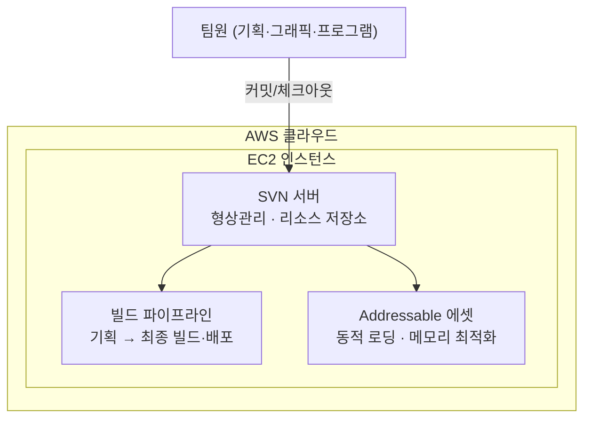

# 클라우드 기반 협업 인프라 구축

**프로젝트**: TPS 슈팅 게임 · 팀 프로젝트 · 2025.06 ~ 2026.05 (11개월)

## 개요

AWS에 SVN 서버를 직접 구축해 개발 환경을 조성, 형상관리·리소스 공유 프로세스를 표준화했습니다.

## 상세 설명

AWS EC2에 SVN 서버를 직접 구축해 팀 전체의 형상관리 허브로 사용했습니다. 여기서 관리되는 리소스가 빌드 파이프라인과 Addressable 에셋 스토어로 이어져 최종 빌드·배포와 런타임 메모리 최적화까지 연결되는 구조입니다.

## 아키텍처

## 스크린샷

_추가 예정_

---
[← 포트폴리오로 돌아가기](https://jjh0204.github.io/JJH0204/)
