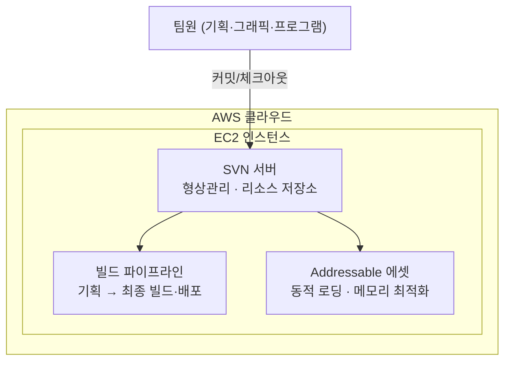

# 클라우드 기반 협업 인프라 구축

**프로젝트**: TPS 슈팅 게임 · 팀 프로젝트 · 2025.06 ~ 2026.05 (11개월)

## 개요

AWS에 SVN 서버를 직접 구축해 개발 환경을 조성, 형상관리·리소스 공유 프로세스를 표준화했습니다.

## 상세 설명

AWS EC2에 SVN 서버를 직접 구축해 팀 전체의 형상관리 허브로 사용했습니다. 여기서 관리되는 리소스가 빌드 파이프라인과 Addressable 에셋 스토어로 이어져 최종 빌드·배포와 런타임 메모리 최적화까지 연결되는 구조입니다.

## Git이 아닌 SVN을 선택한 이유

초기에는 Git 도입을 검토했지만, 팀 구성원의 학습 곡선을 고려해 SVN으로 방향을 바꿨습니다. 팀에는 Git 사용 경험이 없는 디자이너가 있었고, PD 역할을 겸한 학원 강사님도 Git으로 협업해본 경험이 없었습니다. 개발 기간이 정해진 팀 프로젝트에서 형상관리 도구 학습에 시간을 쓰기보다, 구성원 전체가 빠르게 익혀 실제 협업에 곧바로 활용할 수 있는 도구가 우선이라고 판단했습니다.

이에 따라 브랜치·스테이징 같은 개념 없이 직관적인 단일 저장소 구조로 동작하는 SVN을 선택해 AWS에 직접 서버를 구축했고, 팀 전체가 도구에 막히지 않고 형상관리·리소스 공유 프로세스에 빠르게 적응할 수 있었습니다.

## 아키텍처

## 프로그래머로서의 기여

인프라·PM 역할과 별개로, 프로그래머로서 게임 내 시스템과 팀 공용 개발 도구를 직접 구현해 프로젝트에 기여했습니다.

### 몬스터 AI — Behavior Tree 시스템 자체 구현

Unity 내장 기능에 의존하지 않고 Behavior Tree 기반 AI 시스템을 직접 설계·구현했습니다.

- 트리 구조로 몬스터·NPC의 행동을 설계하고, Composite(Selector·Sequence)·Decorator·Leaf 노드로 조건 분기와 행동을 정의
- 런타임에서 트리를 평가·실행하며, 순환 평가(cyclic evaluation)를 방지하도록 노드 구조를 리팩터링
- 보스 페이즈 상태(phase state)와 동적 상태 전환(state management)까지 확장
- 트리를 직접 만들 수 있는 **GraphView 기반 그래프 뷰 에디터**를 함께 구현 — 드래그 앤 드롭으로 노드를 연결·배치하고 트리 구조를 저장/불러오기
- 레포: [github.com/JJH0204/MonsterAI](https://github.com/JJH0204/MonsterAI)

### 팀 공용 개발 도구 제작

- **GOS (Game Object Scripting)** — 게임 오브젝트를 조합해 코드 없이 기믹을 구현하는 비주얼 스크립팅 플러그인. 트리거·타이머·조건/논리·오브젝트 활성화·시네머신 컷씬 등 입력→처리→출력 노드를 제공해, 기획·비프로그래머도 기믹을 직접 구성할 수 있도록 지원. 레포: [github.com/JJH0204/GOS](https://github.com/JJH0204/GOS)
- **UnityPriorityQueue** — 몬스터 AI 등에서 사용할 우선순위 큐 자료구조를 구현해 재사용 가능한 형태로 분리. 레포: [github.com/JJH0204/UnityPriorityQueue](https://github.com/JJH0204/UnityPriorityQueue)

### 트러블슈팅 — 공유한 BT 시스템 오류 대응

팀(8K)에 공유한 Behavior Tree 시스템에서 발생한 오류를 별도 리포지토리로 복제·재현해 원인을 분석하고 해결했습니다. 공용 코드를 배포한 뒤 발생한 문제를 격리된 환경에서 재현·수정하는 대응 경험입니다. 레포: [github.com/JJH0204/8K_BT_Error](https://github.com/JJH0204/8K_BT_Error)

## 관련 레포지토리

- 팀 프로젝트(Phantom:Makina) 백업: [github.com/shion0202/2025_Project_ProjectRecombination](https://github.com/shion0202/2025_Project_ProjectRecombination)

## 스크린샷

_추가 예정_

---
[← 포트폴리오로 돌아가기](https://jjh0204.github.io/JJH0204/)
